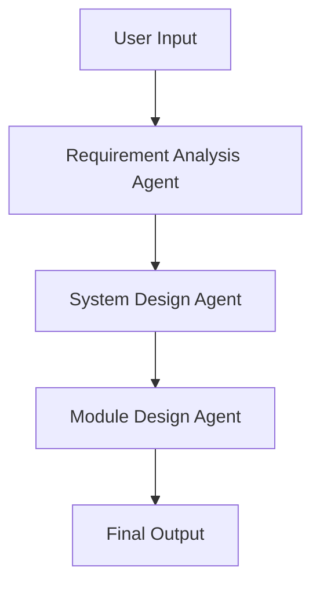
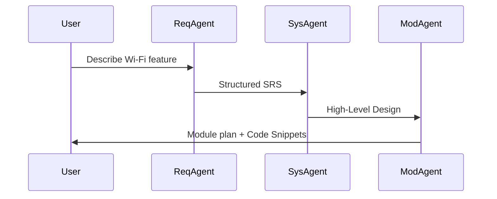

# README.md
# ADK Multi-Agent POC

This project demonstrates a multi-agent system using Google ADK.

## 📦 Release Notes

### GitHub Release Automation
This repo supports automated changelog + release notes via GitHub Actions. To use:

1. Tag a new version (e.g. `v1.0.1`) locally:
```bash
git tag v1.0.1
git push origin v1.0.1
```
2. A GitHub Actions workflow will generate the release and publish it using this README section.

You can customize `.github/workflows/release.yml` as needed.

### v1.0.0 – Initial Public Release
- ✅ Three specialized LLM agents:
  - Requirement Analyzer
  - System Designer
  - Module Designer
- ✅ Sequential workflow (`SequentialAgent`) with full context handoff
- ✅ `.env` & `litellm_config.yaml` support for:
  - Google PaLM
  - OpenAI (via LiteLLM)
  - Ollama local models (via LiteLLM)
- ✅ Built-in CLI + Web UI via `adk web .`
- ✅ Mermaid architecture & sequence diagrams
- ✅ Unit tests with `pytest`
- ✅ Ready for GitHub deployment & extension

## 🧩 Agents

Each agent is defined with a `prompt.py` that includes a clearly structured system instruction.

> ✨ You can **customize the prompt** with parameterized hints depending on user context, model type, or project metadata.
> For example:
>
> ```python
> prompt = f"""
> You are a Requirement Analysis Agent specialized in {domain}.
> Your task is to:
> 1. Understand: {user_goal}
> 2. Ask clarifying questions
> 3. Generate a structured markdown spec
> """
> ```
>
> In production, you can dynamically inject parameters (like user role, input constraints, system settings) before assigning the prompt to `LlmAgent(instruction=...)`.
- **Requirement Analysis Agent**: Understands user needs and generates SRS.
- **System Design Agent**: Analyzes SRS and outputs HLD with trade-off analysis.
- **Module Design Agent**: Decomposes HLD into modules and suggests C prototypes.

## 📁 Project Structure
- `agents/`: individual agents and their prompts
- `workflows/`: Sequential pipeline across agents
- `tools/`: reusable tools (optional)
- `tests/`: pytest-based validation

## 🧠 Architecture Diagram (Mermaid)


## ⏱ Sequence Flow (Mermaid)


## 🚀 Getting Started
```bash
git clone https://github.com/swchen44/ai-agent-POC-adk.git
cd ai-agent-POC-adk
python -m venv .venv && source .venv/bin/activate
pip install -r requirements.txt
cp .env.example .env  # Add your GOOGLE_API_KEY or OPENAI_API_KEY
python run.py
```

## 🧪 Run Tests
```bash
pytest
```

## 🗂️ Optional ADK CLI
```bash
adk run .
```

## 🌐 ADK Web UI (Browser Interface)
ADK also provides a built-in web interface for interactive testing:

```bash
adk web .
```
- Launches a local web server (e.g. http://localhost:8080)
- Uses `adk.yaml` to detect root agent
- Allows live dialogue with the multi-agent workflow via browser

## 🔐 Environment Configuration

This project supports **multiple LLM providers** via Google ADK or [LiteLLM](https://github.com/BerriAI/litellm).

### 📌 Example `.env` for Google PaLM:
```dotenv
ADK_LLM_PROVIDER=google
GOOGLE_API_KEY=your-key-here
GOOGLE_GENAI_USE_VERTEXAI=False
```

### 📌 Example `.env` for OpenAI via LiteLLM:
```dotenv
ADK_LLM_PROVIDER=litellm
LITELLM_MODEL=openai/gpt-4
OPENAI_API_KEY=your-openai-key
```

### 📌 Example `.env` for Ollama (local model):
```dotenv
ADK_LLM_PROVIDER=litellm
LITELLM_MODEL=ollama/llama3
```

### ⚙️ `litellm_config.yaml`
For multiple backend switching, you can define a `litellm_config.yaml` like this:
```yaml
default_model: openai/gpt-4
model_list:
  - model_name: openai/gpt-4
    litellm_provider: openai
    api_key: $OPENAI_API_KEY
  - model_name: ollama/llama3
    litellm_provider: ollama
    api_base: http://localhost:11434
```

The system will auto-detect and use the model defined in `.env` or fallback to the default.

## ✅ Output Example
```text
🧠 請輸入你的 Wi-Fi 功能需求 (例如: 支援 frame aggregation)：
👉 支援 frame aggregation 功能
🤖 輸出: 模組設計如下...（依序由三個 Agent 回覆）
```
