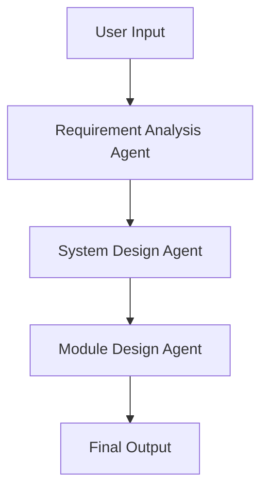
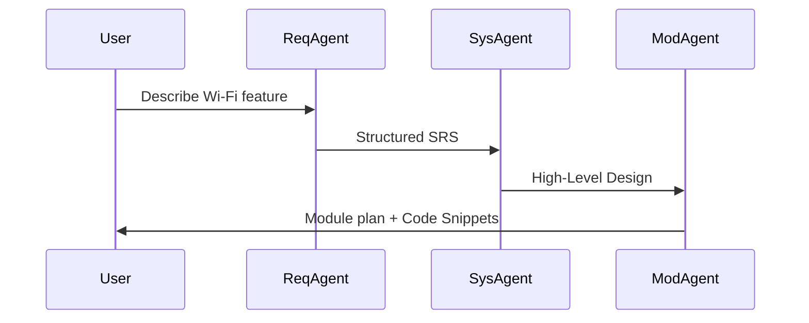

# ADK Multi-Agent POC

This project demonstrates a multi-agent system using Google ADK.

## 🧩 Agents
- **Requirement Analysis Agent**: Understands user needs and generates SRS.
- **System Design Agent**: Analyzes SRS and outputs HLD with trade-off analysis.
- **Module Design Agent**: Decomposes HLD into modules and suggests C prototypes.

## 📁 Project Structure
- `agents/`: individual agents and their prompts
- `workflows/`: Sequential pipeline across agents
- `tools/`: reusable tools (optional)
- `tests/`: pytest-based validation

## 🧠 Architecture Diagram (Mermaid)


## ⏱ Sequence Flow (Mermaid)


## 🚀 Getting Started
```bash
git clone https://github.com/swchen44/ai-agent-POC-adk.git
cd ai-agent-POC-adk
python -m venv .venv && source .venv/bin/activate
pip install -r requirements.txt
cp .env.example .env  # Add your GOOGLE_API_KEY
python run.py
```

## 🧪 Run Tests
```bash
pytest
```

## 🗂️ Optional ADK CLI
```bash
adk run .
```

## 🌐 ADK Web UI (Browser Interface)
ADK also provides a built-in web interface for interactive testing:

```bash
adk web .
```
- Launches a local web server (e.g. http://localhost:8080)
- Uses `adk.yaml` to detect root agent
- Allows live dialogue with the multi-agent workflow via browser


## 🔐 Environment Configuration
`.env.example` is provided. You must set at least:
```dotenv
GOOGLE_API_KEY=your-key-here
GOOGLE_GENAI_USE_VERTEXAI=False
```

## ✅ Output Example
```text
🧠 請輸入你的 Wi-Fi 功能需求 (例如: 支援 frame aggregation)：
👉 支援 frame aggregation 功能
🤖 輸出: 模組設計如下...（依序由三個 Agent 回覆）
```
