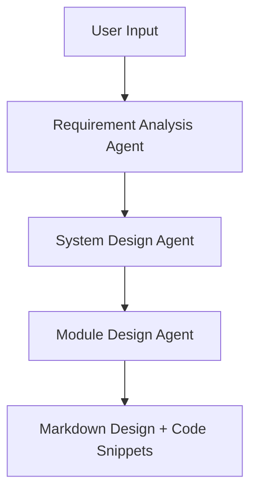

# ADK Multi-Agent POC — Design Overview

This document provides an in-depth explanation of the design, goals, comparisons, limitations, and future roadmap of the ADK multi-agent system. It supplements the technical README with a broader architectural and conceptual view.

---

## 🎯 Project Purpose

- Enable **multi-step software co-design** using LLM agents, modeled on the V-Model development lifecycle.
- Leverage **separation of concerns** through modular agents: requirements analysis, system design, and module decomposition.
- Provide plug-and-play support for **multiple LLM backends** via LiteLLM: Google PaLM, OpenAI, Ollama.
- Offer both **CLI and Web UI** interfaces through Google ADK.

---

## 🧱 System Architecture

Each agent receives shared `state`, enriching or transforming it:
- ✅ `RequirementAnalyzer` → produces `state['requirements']`
- ✅ `SystemDesigner` → produces `state['system_design']`
- ✅ `ModuleDesigner` → produces `state['module_plan']`

---

## ⚖️ Comparison: ADK vs Traditional Prompt Chains

| Feature                        | ADK Multi-Agent Workflow     | Manual Prompt Chains        |
|-------------------------------|-------------------------------|------------------------------|
| Memory Sharing                | ✅ via `state` object         | ❌ manual copy-paste         |
| Modularity                    | ✅ agent-per-role             | ❌ mixed logic                |
| Prompt Customization          | ✅ each agent loads from file | ❌ inline/injected           |
| Testing Support               | ✅ `pytest` per prompt        | ❌ manual                    |
| Multi-Backend Flexibility     | ✅ via `litellm_config.yaml`  | ❌ single provider hardcoded |
| Interactive Web UI            | ✅ `adk web .`                | ❌ none                      |

---

## 🔍 Key Design Concepts

### ✅ Prompt as Code
Each agent uses its own `prompt.py` file, enabling programmatic prompt generation or dynamic parameter injection.

### ✅ SequentialAgent Composition
A `SequentialAgent` composes the three functional agents, passing shared state in order.

### ✅ Model Agnosticism
Uses `LITELLM_MODEL` to swap providers like OpenAI, Ollama, Anthropic without code changes.

---

## 📌 Design Trade-offs

| Trade-off                     | Benefit                                    | Limitation                               |
|------------------------------|--------------------------------------------|-------------------------------------------|
| Fine-grained agents          | High flexibility and modularity            | Higher implementation overhead            |
| Prompt-driven logic          | Easy to iterate and evolve instructions    | Less deterministic without control flows |
| Model-pluggability           | Use local/cloud models easily              | Slight complexity in `.env` configuration |

---

## 🚧 Current Limitations

- ❌ No long-term memory persistence between sessions
- ❌ Limited to single user per session
- ❌ No guardrails or content moderation (out-of-the-box)
- ❌ ADK’s Web UI lacks markdown or rich output rendering

---

## 🌱 Future TODOs

- [ ] Add context-based agent activation (e.g. skip if state is complete)
- [ ] Add visualization of output (render HLD/module map into diagram)
- [ ] Integrate `tests/` with CI/CD pipeline (GitHub Actions)
- [ ] Add API layer for embedding in external workflows
- [ ] Memory persistence across sessions

---

## 🧠 Use Cases

- Embedded system design co-piloting (e.g. Wi-Fi stack planning)
- Multi-stage software architecture design (requirements → modules)
- Educational systems teaching V-Model using LLMs
- Prompt engineering research on delegation and role-play

---

## 📸 Screenshot Example (Web UI)
> _(Insert screenshot of ADK web interface here)_

---

## ✅ Summary

This ADK-powered multi-agent system enables fast, structured ideation and design for complex software workflows. It abstracts away state management, memory flow, prompt formatting, and multi-model orchestration.

While early-stage, it offers a promising architecture for future self-organizing LLM systems.

