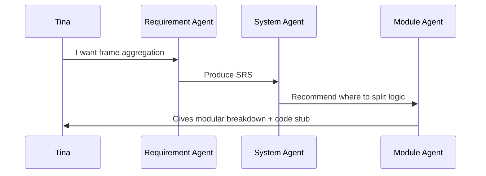

# 📚 User Story Collection — ADK Multi-Agent POC

This document collects realistic user stories to help demonstrate the use cases and benefits of the ADK-powered multi-agent system. Each story highlights pain points, solution flows, and agent interactions.

---

## 👩‍💻 Story 1: Embedded Firmware Architect — Tina

> **"I need to design a new Wi-Fi feature that splits logic across firmware, kernel, and user space."**

### 🧩 Problem
Tina is a senior firmware engineer. Her problem isn’t just writing code, but aligning cross-boundary logic (e.g. frame aggregation handling) across:
- embedded SoC firmware
- Linux kernel drivers
- user-space config utilities

### 🧠 Solution Flow

### ✅ Value
- Clarifies firmware vs kernel vs user responsibilities
- Generates modular diagram and C stub prototypes
- Offers trade-off analysis Tina can review with team

---

## 🧑‍🏫 Story 2: Computer Science Lecturer — James

> **"I teach the V-Model. I want students to understand iterative decomposition in real-time."**

### 🧩 Problem
James wants an engaging classroom tool that shows:
- how requirements turn into code
- what different design layers look like
- how LLM agents can play engineering roles

### 🧠 Solution Flow
- Students input a sample project (e.g. "build a drone controller")
- Agents guide through requirements → architecture → code
- Instructor highlights agent prompts, state flow, and markdown output

### ✅ Value
- Interactive demo of structured design thinking
- No setup or API key required (can run with Ollama locally)
- Teaches V-model + AI simultaneously

---

## 👷 Story 3: Solo Developer — Max

> **"I want a weekend prototype for a project using agents."**

### 🧩 Problem
Max wants to test an idea for a co-pilot for IoT product design, but has no time to write each prompt.

### 🧠 Solution
- Forks this repo
- Replaces prompt files for specific domain (e.g. HVAC automation)
- Uses `adk web .` to simulate agent-based collaboration

### ✅ Value
- Launches multi-agent dialog without writing agent code
- Modular prompts allow rapid domain adaptation

---

## 🧪 Testing Persona: QA Analyst — Wendy

> **"I want to write tests for each agent before production deployment."**

### 🧩 Problem
Wendy’s team wants guardrails around prompt behavior, especially for regulated domains.

### 🧠 Solution
- Uses `pytest` to test whether prompt produces expected keys
- Defines static sample states to validate each agent step

### ✅ Value
- Repeatable CI/CD safe-guard for prompt drift
- Supports LiteLLM switching to test model consistency

---

## 🧵 Summary
These user stories represent realistic, cross-functional usage of multi-agent LLM workflows:
- Engineering guidance
- Teaching and simulation
- Domain-specific prototyping
- Prompt safety assurance

Each persona interacts differently with agents, but benefits from modularity, state flow, and prompt transparency.

